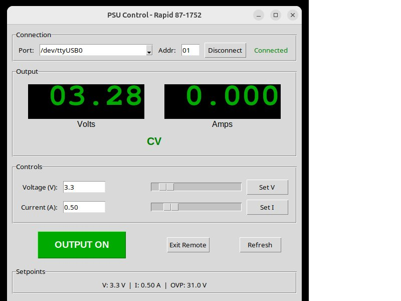

# Rapid 87-1752 PSU Control

Python GUI controller for programmable power supplies via RS-485/serial interface. Supports multiple protocols and PSU families.


## Supported Hardware

### Rapid/Manson Protocol (Auto-detected)

| Brand | Model | Voltage/Current |
|-------|-------|-----------------|
| Rapid Electronics | 87-1752 | 30V/3A |
| PeakTech | 1860 | 30V/3A |
| Manson | NDP-4303 | 30V/3A |
| Manson | NDP-4185 | 18V/5A |
| Manson | NDP-4601 | 60V/1.5A |
| Voltcraft | PPS series | Various |

### SCPI Protocol (Auto-detected)

| Brand | Model | Voltage/Current |
|-------|-------|-----------------|
| Array Electronic | 3664A | 120V/4.2A |
| Array Electronic | 3663A | 80V/6.5A |
| Array Electronic | 3662A | 60V/8.5A |
| Array Electronic | 3661A | 40V/12A |
| Array Electronic | 3660A | 30V/16A |

The software auto-detects the protocol and PSU model on connection.

## Features

- **Protocol auto-detection** - automatically identifies PSU type (SCPI or Rapid/Manson)
- **Dynamic limits** - reads max voltage/current from PSU, adjusts controls accordingly
- **Model identification** - detects PSU model and displays in window title
- Real-time voltage/current monitoring with large LED-style display
- Voltage and current control with sliders
- Quick presets (3.3V, 5V, 9V, 12V, 24V)
- LiPo battery charger (CC/CV with termination detection)
- Auto-reconnect on USB disconnect/reconnect
- **USB reset button** - recover stuck serial adapters without unplugging (Linux)
- Multi-unit support (addresses 00-30 for Rapid/Manson protocol)

## Requirements

- Python 3.8+
- USB-to-RS485 adapter (CH340 or FTDI based)
- 120Ω termination resistor across A+/B-

### Python Dependencies

```bash
pip install pyserial
```

Tkinter is included with most Python installations.

## Hardware Setup

1. Connect USB-to-RS485 adapter to your computer
2. Wire adapter to PSU rear panel:
   - A+ to A+
   - B- to B-
   - GND to GND
3. Add 120Ω termination resistor across A+ and B-
4. Set PSU address via front panel (default: 01)

## Installation

### Windows

Download `psu_control.exe` from the [Releases](../../releases) page. No Python installation required.

### Linux / macOS

```bash
pip install pyserial
python psu_control.py
```

## Usage

The GUI will auto-detect the serial port and PSU protocol on startup. The window title shows the detected PSU model.

### LiPo Charging

1. Select cell count (1S-7S)
2. Set charge current (typ. 1C)
3. Set termination current (typ. C/20 = 0.05A for 1Ah)
4. Click "Start Charge"
5. Charging stops automatically when current drops below termination threshold

## Linux: USB Troubleshooting

### Prevent USB Autosuspend

USB autosuspend can cause disconnects with CH340/FTDI adapters. Install the udev rule:

```bash
sudo cp 99-usb-serial-reset.rules /etc/udev/rules.d/
sudo udevadm control --reload-rules && sudo udevadm trigger
```

Then reconnect the adapter.

### USB Reset

If your serial adapter becomes unresponsive, click the "Reset USB" button in the GUI. This attempts to reset the USB device without unplugging. Note: May require root privileges or appropriate udev rules.

## Windows: USB Troubleshooting

If you experience connection drops on Windows:

1. **Device Manager > USB Root Hub > Power Management**
   - Uncheck "Allow computer to turn off this device"
2. **Power Options > USB settings > USB selective suspend**
   - Set to "Disabled"
3. **Install CH340 driver** if using a CH340-based adapter

## Protocol Documentation

See [PROTOCOL.md](PROTOCOL.md) for the complete RS-485 command reference.

## Screenshots



## Known Issues

- Output enable logic is inverted in the protocol (`0` = ON, `1` = OFF)
- Front panel is locked during remote mode - use "Exit Remote" to regain manual control
- 4-digit readings but only 3-digit setpoint precision

## Contributing

Issues and pull requests welcome. This project originated from reverse-engineering a 20-year-old PSU with lost documentation.

## Attribution

- Protocol reverse-engineering: Tom (EEVblog community)
- PeakTech 1860 manual preservation: pewa.de
- OEM variant identification: EEVblog forum user **smk**
- Documentation assistance: Claude (Anthropic)

## License

Public Domain. Use freely, share freely, modify freely.
